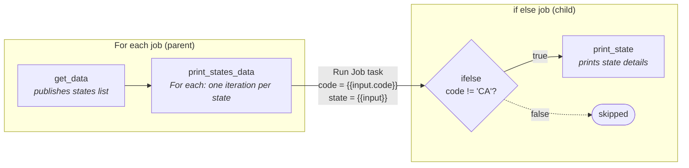

# Databricks dynamic job orchestration

A hands-on exercise I created to apply what I learned about **dynamic job orchestration in Lakeflow Jobs**. The use case is deliberately simple (a mock list of US states), so the focus stays on the orchestration patterns rather than the data: (Yes, all of this could be done in a single job, but the idea was to make a dynamic job orchestration)

- a parent job builds a list at runtime and loops over it with a **For each** task
- each iteration triggers a child job that **branches per item** with an **If/else condition** task
- values flow between tasks and jobs through **task values** and **job parameters**

Both jobs, their parameters and the wiring between them are defined as code with **Declarative Automation Bundles** and deployed with a single CLI command.

## How it works



## Project structure

```
.
├── databricks.yml                     # bundle definition and dev/prod targets
├── resources/
│   ├── for_each_job_parent.job.yml    # parent job: get_data → For each
│   └── if_else_job.job.yml            # child job: condition → print_state
└── src/
    ├── create_mock_states_data.ipynb  # builds and publishes the states list
    └── print_state_data.ipynb         # reads the "state" parameter and prints it
```

The parent references the child by resource key — `job_id: ${resources.jobs.if_else_job.id}` — so the link resolves to the right job ID in whichever workspace the bundle is deployed to.

## Deploy and run

Requires the [Databricks CLI](https://docs.databricks.com/dev-tools/cli/install) and a workspace with serverless compute.

```bash
databricks auth login --host <your-workspace-url>

databricks bundle validate -t dev
databricks bundle deploy -t dev
databricks bundle run -t dev for_each_job_parent
```

The `dev` target uses development mode: deployed jobs are prefixed with `[dev <your-user>]` and any schedules are paused. Use `-t prod` for the production target, and `databricks bundle destroy -t dev` to remove everything the bundle deployed.

Update `workspace.host` in `databricks.yml` to point at your own workspace.

## What this exercise covers

- **Runtime-driven loops:** For each inputs come from an upstream task value (`{{tasks.<key>.values.<name>}}`), so the number of iterations is decided by the data, not hard-coded.
- **Branching in the orchestration layer:** an If/else condition task with `true` / `false` outcomes, instead of `if` statements buried in notebook code.
- **Passing data across tasks and jobs:** task values within a job; job parameters and dynamic value references (`{{input}}`, `{{input.code}}`, `{{job.parameters.<name>}}`) between jobs.
- **Jobs as code:** UI-built jobs exported into a bundle, with the parent-to-child link resolved by resource key and separate `dev` / `prod` targets.

## License

[MIT](LICENSE)
